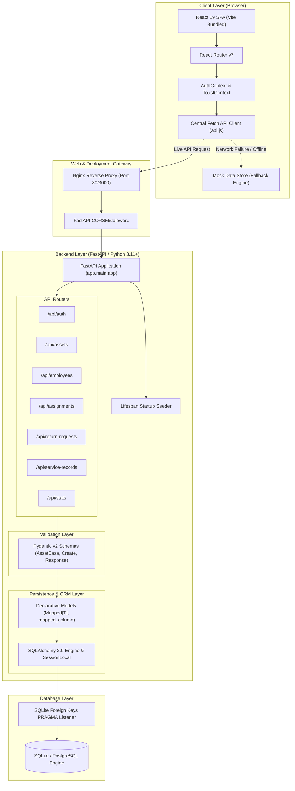
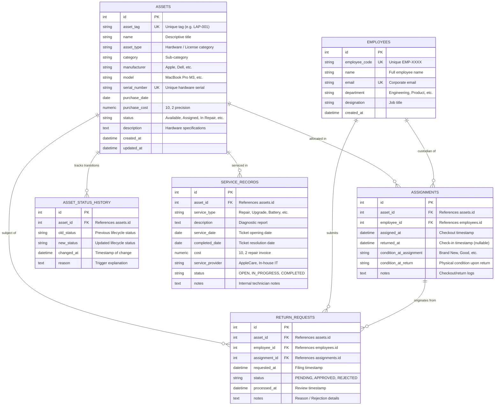
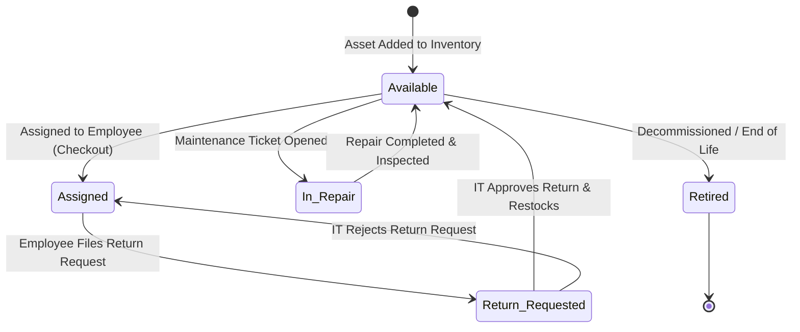

# 🏢 Company Asset Management System: Complete Project Explanation & Interview Preparation Master Guide

> **Target Audience:** Software Engineering Candidates, Full-Stack Developers, Backend Engineers, and Technical Interviewers.  
> **Repository:** Company Asset Management System (Enterprise Portal)  
> **Tech Stack:** Python 3.11+, FastAPI, SQLAlchemy 2.0, Pydantic v2, SQLite / PostgreSQL, React 19, Vite, React Router v7, Vanilla CSS Design System, Docker, Pytest.

---

## 📑 Table of Contents

1. [Executive Project Overview & Business Value](#1-executive-project-overview--business-value)
2. [End-to-End System Architecture](#2-end-to-end-system-architecture)
3. [Deep Dive: Technology Stack & Architectural Decisions](#3-deep-dive-technology-stack--architectural-decisions)
   - [Backend: FastAPI, SQLAlchemy 2.0, Pydantic v2](#31-backend-fastapi-sqlalchemy-20--pydantic-v2)
   - [Frontend: React 19, Vite, React Router v7, Design System](#32-frontend-react-19-vite-react-router-v7--design-system)
   - [Resilient API Layer: Dual-Mode Mock Fallback](#33-resilient-api-layer-dual-mode-mock-fallback)
   - [Testing & Quality Assurance: Pytest & TestClient](#34-testing--quality-assurance-pytest--testclient)
   - [DevOps & Cloud Deployment: Docker, Nginx, Render, Vercel](#35-devops--cloud-deployment-docker-nginx-render-vercel)
4. [Deep Dive: Database Architecture & Data Modeling](#4-deep-dive-database-architecture--data-modeling)
   - [Database Strategy: SQLite vs PostgreSQL](#41-database-strategy-sqlite-vs-postgresql)
   - [Entity-Relationship Diagram (ERD)](#42-entity-relationship-diagram-erd)
   - [Table Specifications & Constraints](#43-table-specifications--constraints)
   - [Relational Modeling & Foreign Key Cascades](#44-relational-modeling--foreign-key-cascades)
   - [Transaction Management & ACID Guarantees](#45-transaction-management--acid-guarantees)
   - [Query Optimization & Indexing Strategy](#46-query-optimization--indexing-strategy)
5. [Deterministic State Machine & Core Business Workflows](#5-deterministic-state-machine--core-business-workflows)
   - [Asset Lifecycle State Diagram](#51-asset-lifecycle-state-diagram)
   - [State Transition Rules & Safeguards](#52-state-transition-rules--safeguards)
   - [End-to-End Workflow Walkthroughs](#53-end-to-end-workflow-walkthroughs)
   - [Audit Trail & Status History](#54-audit-trail--status-history)
6. [Interview Preparation Guide: Pitching the Project](#6-interview-preparation-guide-pitching-the-project)
   - [The 30-Second Elevator Pitch](#61-the-30-second-elevator-pitch)
   - [The 2-Minute Technical Pitch](#62-the-2-minute-technical-pitch)
   - [The STAR Method Breakdown](#63-the-star-method-breakdown)
7. [Top 25 Technical Interview Questions & High-Impact Answers](#7-top-25-technical-interview-questions--high-impact-answers)
   - [Category 1: System Design & Architecture](#category-1-system-design--architecture)
   - [Category 2: Database, Modeling & Transactions](#category-2-database-modeling--transactions)
   - [Category 3: Backend, FastAPI & SQLAlchemy](#category-3-backend-fastapi--sqlalchemy)
   - [Category 4: Frontend, React & State Management](#category-4-frontend-react--state-management)
   - [Category 5: Concurrency, Edge Cases & Security](#category-5-concurrency-edge-cases--security)
8. [Technical Challenges Faced & How You Solved Them](#8-technical-challenges-faced--how-you-solved-them)
9. [Scalability, Production Readiness & Future Roadmap](#9-scalability-production-readiness--future-roadmap)
10. [Quick Reference Cheat Sheet (Credentials, Commands & Endpoints)](#10-quick-reference-cheat-sheet-credentials-commands--endpoints)

---

## 1. Executive Project Overview & Business Value

### What is the Company Asset Management System?
The **Company Asset Management System** is a full-stack, enterprise-grade internal portal built to track, allocate, maintain, and audit all physical hardware (laptops, workstations, test mobiles, monitors) and software licenses owned by an organization.

### The Real-World Business Problem
In mid-sized to large organizations:
1. **Ghost Assets & Equipment Loss:** Unrecorded hardware checkouts lead to thousands of dollars in lost inventory during employee exits or team transitions.
2. **Spreadsheet Chaos:** IT teams typically manage millions in hardware using shared Excel/Google Sheets, which lack relational integrity, audit trails, concurrent access safety, and automated state transitions.
3. **Software License Waste:** Unused seats on expensive software (e.g., Figma, JetBrains, Adobe Creative Cloud) remain assigned to inactive projects without visibility.
4. **Maintenance Blind Spots:** Hardware failures, battery degradation, and warranty expirations go untracked until machines fail permanently.
5. **No Employee Self-Service:** Employees have no transparent way to view what is under their custody or formally initiate equipment returns.

### The Solution Delivered
- **Relational Custody Tracking:** Precise assignment records linking assets to employees with timestamped check-in/check-out logs and physical condition grades (`Brand New`, `Excellent`, `Good`, `Fair`, `Damaged`).
- **Deterministic State Machine:** Strict validation rules governing asset states (`Available`, `Assigned`, `Return Requested`, `In Repair`, `Retired`) preventing illegal operations such as assigning already-checked-out equipment.
- **Audit Compliance:** Automatic logging of every state change into an immutable `AssetStatusHistory` table with timestamps and contextual reason strings.
- **Role-Based Portals:**
  - **IT Administrators:** Comprehensive dashboard analytics, asset CRUD, employee onboarding, allocation approvals, maintenance tickets, and return queue processing.
  - **Employees:** Self-service portal (`/my-assets`) to monitor assigned equipment, view historical custody, and file return requests.
- **Maintenance Lifecycle:** Full service ticketing system tracking repair diagnostics, vendors, scheduled completion dates, and repair costs.

---

## 2. End-to-End System Architecture

The application adopts a **decoupled Client-Server Architecture** adhering to RESTful principles, clean separation of concerns, and containerized deployment readiness.



### Architectural Highlights
- **Decoupled Deployment:** Frontend and Backend run in isolated containers or distinct cloud services (e.g., Vercel static hosting for Frontend, Render/Railway container for Backend).
- **Layered Backend Design:**
  - **Routers (`app/routers/`):** Handle HTTP verbs, query/path parameters, dependency injection (`Depends(get_db)`), and route definitions.
  - **Schemas (`app/schemas/`):** Pure Pydantic v2 classes handling request validation, data sanitization, field transformation, and JSON serialization.
  - **Models (`app/models/`):** SQLAlchemy ORM declarative models defining database schema, column constraints, indexes, and relationships.
  - **Database (`app/database.py`):** Connection pool management, engine initialization, session lifecycle, and cross-dialect normalization.
- **Fail-Safe Client Architecture:** The frontend API service includes an intelligent fallback mechanism (`api.js` + `mockData.js`) that ensures the UI remains fully functional even in restricted demonstration environments or offline settings.

---

## 3. Deep Dive: Technology Stack & Architectural Decisions

### 3.1 Backend: FastAPI, SQLAlchemy 2.0 & Pydantic v2

| Component | Choice | Why It Was Chosen Over Alternatives |
| :--- | :--- | :--- |
| **Language** | **Python 3.11+** | Modern type hinting (`str \| None`), enhanced performance (25-30% faster than Python 3.10), clean syntax, and rich ecosystem. |
| **Web Framework** | **FastAPI 0.110+** | **Over Flask/Django:** Native asynchronous ASGI support, automatic OpenAPI/Swagger interactive documentation (`/docs`), seamless Pydantic v2 integration, and dependency injection system. Flask requires third-party plugins for schemas and docs; Django is excessively heavy and monolithic for a dedicated REST API. |
| **ORM** | **SQLAlchemy 2.0+** | **Over Tortoise/Peewee:** SQLAlchemy 2.0 introduces fully typed declarative mappings (`Mapped[int] = mapped_column(...)`), unified `select()` syntax, robust transaction safety, mature connection pooling, and cross-engine database compatibility (SQLite to PostgreSQL). |
| **Data Validation** | **Pydantic v2** | **Over Marshmallow/Cerberus:** Pydantic v2 core is written in Rust, delivering 5x-20x faster serialization and validation. Features `@field_validator` and `@model_validator` for bidirectional field normalization. |
| **ASGI Server** | **Uvicorn** | High-performance, production-ready ASGI web server built on `uvloop` and `httptools`. |

#### Code Highlights: Modern SQLAlchemy 2.0 Declarative Syntax
```python
# Modern 2.0 typed column mapping with primary key index
id: Mapped[int] = mapped_column(primary_key=True, index=True)
asset_tag: Mapped[str] = mapped_column(String(50), unique=True, nullable=False)
status: Mapped[str] = mapped_column(String(50), default="Available", nullable=False)

# Explicit relationship definitions with cascading delete
assignments = relationship(
    "Assignment",
    back_populates="asset",
    cascade="all, delete-orphan"
)
```

#### Code Highlights: Pydantic v2 Bidirectional Data Synchronization
In [backend/app/schemas/asset.py](file:///d:/ADP/company-asset-management/backend/app/schemas/asset.py), notice how user input is normalized:
```python
@field_validator("status", mode="before")
@classmethod
def validate_status(cls, v: Any) -> str:
    if v is None:
        return "Available"
    return normalize_status(v)  # Normalizes "in_repair" -> "In Repair"

@model_validator(mode="after")
def sync_fields(self):
    # Automatically synchronizes description and specifications aliases
    if self.description and not self.specifications:
        self.specifications = self.description
    elif self.specifications and not self.description:
        self.description = self.specifications
    return self
```

---

### 3.2 Frontend: React 19, Vite, React Router v7 & Design System

| Component | Choice | Why It Was Chosen Over Alternatives |
| :--- | :--- | :--- |
| **Framework** | **React 19** | Industry standard, declarative component paradigm, robust hooks ecosystem, and concurrent rendering support. |
| **Build Tool** | **Vite 5+** | **Over Create-React-App / Webpack:** Native ES modules (ESM) architecture delivers instant cold start (<300ms) and lightning-fast Hot Module Replacement (HMR). Create-React-App is deprecated and bloated. |
| **Routing** | **React Router v7** | Standard declarative routing with layout nesting, dynamic route parameters (`:id`), and programmatic navigation (`useNavigate`). |
| **Styling** | **Custom Vanilla CSS Design System** | **Over TailwindCSS / Material-UI:** Built from foundational CSS Custom Properties (`variables.css`, `layout.css`, `components.css`, `tables.css`). Zero runtime overhead, clean HTML semantics, custom dark/slate enterprise aesthetic, full control over typography, and zero third-party dependency vulnerabilities. |
| **State Management** | **React Context API** | **Over Redux / Zustand:** The app has well-bounded state needs: authentication (`AuthContext`) and global feedback banners (`ToastContext`). Using Redux would introduce needless boilerplate and complexity. |

---

### 3.3 Resilient API Layer: Dual-Mode Mock Fallback
A standout design pattern in this project is the **Transparent Mock Fallback Engine** implemented in [frontend/src/services/api.js](file:///d:/ADP/company-asset-management/frontend/src/services/api.js).
- When `VITE_USE_MOCK=false`, the client issues real HTTP `fetch()` calls to the FastAPI backend.
- If the backend is unavailable or a network error occurs, the client seamlessly falls back to `mockData.js`, which simulates backend state machine mutations in-memory.
- This architectural design allows the application to be demonstrated, evaluated, and tested under any network conditions without crashing or presenting blank screens.

---

### 3.4 Testing & Quality Assurance: Pytest & TestClient
The backend includes a dedicated test suite with **23 automated tests** in [backend/tests/](file:///d:/ADP/company-asset-management/backend/tests) using `pytest` and Starlette's `TestClient`.

#### Key Testing Capabilities:
- **Isolated SQLite In-Memory Database:** Defined in `conftest.py`, ensuring tests never contaminate production or development data.
- **100% Core Flow Coverage:**
  - Asset CRUD & duplicate constraint validation (409 Conflict).
  - Search and multi-criteria filter tests.
  - Complete assignment lifecycle (Checkout -> Active -> Return -> Status History).
  - Return Request approval and rejection state transitions.
  - Service record maintenance creation and completion Restocking.
  - Authentication and registration verification.

---

### 3.5 DevOps & Cloud Deployment: Docker, Nginx, Render, Vercel

```
Production Container Topology:
+-----------------------------------------------------------+
| docker-compose.yml                                        |
|                                                           |
|  +---------------------------+  +----------------------+  |
|  | Frontend Container        |  | Backend Container    |  |
|  | (Port 3000:80)            |  | (Port 8000:8000)     |  |
|  | - Multi-stage build       |  | - Python 3.11-slim   |  |
|  | - Node 18 build step      |  | - FastAPI + Uvicorn  |  |
|  | - Nginx static server     |  | - Healthcheck loop   |  |
|  | - /nginx.conf SPA rewrite |  | - Persistent Volume  |  |
|  +---------------------------+  +----------------------+  |
|               |                            |              |
|               +------ depends_on ----------+              |
|                      (service_healthy)                    |
+-----------------------------------------------------------+
```

1. **Multi-Stage Dockerfile (Frontend):** Stage 1 compiles React assets using Vite; Stage 2 injects the static bundle into an ultra-lean Nginx Alpine image with custom client-side SPA fallback rules (`try_files $uri $uri/ /index.html`).
2. **Lean Dockerfile (Backend):** Utilizes `python:3.11-slim`, installs requirements without cache (`--no-cache-dir`), and configures healthchecks querying `/api/health`.
3. **Infrastructure as Code:**
   - [`docker-compose.yml`](file:///d:/ADP/company-asset-management/docker-compose.yml): Orchestrates frontend and backend with dependency conditions (`service_healthy`) and volume persistence.
   - [`render.yaml`](file:///d:/ADP/company-asset-management/render.yaml): Blueprint for automated cloud deployment of both services on Render.com.
   - [`frontend/vercel.json`](file:///d:/ADP/company-asset-management/frontend/vercel.json): SPA rewrite rules for zero-configuration Vercel frontend deployments.

---

## 4. Deep Dive: Database Architecture & Data Modeling

### 4.1 Database Strategy: SQLite vs PostgreSQL
In [backend/app/database.py](file:///d:/ADP/company-asset-management/backend/app/database.py), the connection engine is architected to be **dialect-agnostic**:

```python
raw_url = os.getenv("DATABASE_URL", f"sqlite:///{DEFAULT_DB_PATH}")
# Normalizes cloud provider URLs (Render/Supabase use postgres://, SQLAlchemy requires postgresql://)
if raw_url.startswith("postgres://"):
    DATABASE_URL = raw_url.replace("postgres://", "postgresql://", 1)
else:
    DATABASE_URL = raw_url

engine = create_engine(
    DATABASE_URL,
    connect_args={"check_same_thread": False} if "sqlite" in DATABASE_URL else {}
)

# Crucial: Enable foreign key constraint enforcement in SQLite
if "sqlite" in DATABASE_URL:
    @event.listens_for(engine, "connect")
    def set_sqlite_pragma(dbapi_connection, connection_record):
        cursor = dbapi_connection.cursor()
        cursor.execute("PRAGMA foreign_keys=ON")
        cursor.close()
```

> [!IMPORTANT]
> **Why `PRAGMA foreign_keys=ON` is critical:** By default, SQLite disables foreign key constraint enforcement for legacy backward compatibility. Without this event listener, foreign key violations (like deleting an employee with active assignments) would silently succeed. This listener ensures SQLite behaves with identical relational integrity to PostgreSQL.

---

### 4.2 Entity-Relationship Diagram (ERD)



---

### 4.3 Table Specifications & Constraints

#### 1. Table: `assets`
- **Primary Key:** `id` (Integer, auto-increment, indexed).
- **Unique Constraints:** `asset_tag` (String 50, Not Null), `serial_number` (String 100, Nullable).
- **Check / Domain Rule:** `status` must match one of: `Available`, `Assigned`, `In Repair`, `Return Requested`, `Retired`.
- **Financial Precision:** `purchase_cost` is defined as `Numeric(10, 2)` to eliminate floating-point rounding errors common with standard `FLOAT` types.
- **Timestamps:** `created_at` defaults to UTC now; `updated_at` utilizes `onupdate=lambda: datetime.now(timezone.utc)`.

#### 2. Table: `employees`
- **Primary Key:** `id` (Integer, auto-increment, indexed).
- **Unique Constraints:** `employee_code` (e.g., `EMP-1001`), `email` (Not Null, unique, case-sanitized).
- **Fields:** `name`, `department`, `designation`, `created_at`.

#### 3. Table: `assignments`
- **Foreign Keys:**
  - `asset_id` -> `assets.id` (Not Null).
  - `employee_id` -> `employees.id` (Not Null).
- **Active State Determination:** When `returned_at IS NULL`, the assignment is actively ongoing. When `returned_at` is populated, it represents a historical record.
- **Physical Condition Audit:** Records `condition_at_assignment` and `condition_at_return` for equipment damage accountability.

#### 4. Table: `return_requests`
- **Foreign Keys:** `asset_id` -> `assets.id`, `employee_id` -> `employees.id`, `assignment_id` -> `assignments.id`.
- **Status Lifecycle:** `PENDING` -> `APPROVED` or `REJECTED`.
- **Processing Timestamp:** `processed_at` populated upon IT decision.

#### 5. Table: `service_records`
- **Foreign Keys:** `asset_id` -> `assets.id`.
- **Status:** `OPEN`, `IN_PROGRESS`, `COMPLETED`.
- **Financials:** `cost` (`Numeric(10, 2)`) tracks organizational repair expenditures.

#### 6. Table: `asset_status_history`
- **Purpose:** Append-only, immutable audit trail.
- **Fields:** `asset_id` (FK), `old_status`, `new_status`, `changed_at`, `reason`.

---

### 4.4 Relational Modeling & Foreign Key Cascades
All child relationships on the `Asset` model specify `cascade="all, delete-orphan"`.
- If an asset is decommissioned and deleted, its corresponding status history entries, service tickets, and assignment records are cleanly purged, avoiding dangling foreign keys or orphan rows.
- On `assignments`, deleting an assignment cascades to pending return requests associated with that specific checkout.

---

### 4.5 Transaction Management & ACID Guarantees

In FastAPI, database sessions are injected via the `get_db()` dependency generator:

```python
def get_db():
    db = SessionLocal()
    try:
        yield db
    finally:
        db.close()
```

#### Why Multi-Entity State Changes Are Atomic:
Consider what happens when an IT administrator approves a return request in [backend/app/routers/return_request.py](file:///d:/ADP/company-asset-management/backend/app/routers/return_request.py#L133-L184):
1. The `ReturnRequest` status is modified to `APPROVED`.
2. The associated `Assignment` record has `returned_at` set to UTC now and records `condition_at_return`.
3. The `Asset` status transitions from `Return Requested` back to `Available`.
4. A new audit entry is inserted into `AssetStatusHistory`.
5. **A single `db.commit()` is issued.**

**ACID Guarantee:** If any step fails (e.g., database constraint failure, disk exhaustion), the session rolls back completely (`db.rollback()`). The asset will never be left in an inconsistent state where the return is marked approved but the hardware remains marked as `Return Requested`.

---

### 4.6 Query Optimization & Indexing Strategy
1. **Primary & Unique Key Indexing:** SQLite and PostgreSQL automatically create B-Tree indexes for `PRIMARY KEY` and `UNIQUE` constraints (`id`, `asset_tag`, `serial_number`, `employee_code`, `email`).
2. **Case-Insensitive Pattern Searches:** The search endpoints implement SQL `ilike` pattern matching wrapped in `or_` clauses:
   ```python
   search_pattern = f"%{search}%"
   query = query.filter(
       or_(
           Asset.name.ilike(search_pattern),
           Asset.asset_tag.ilike(search_pattern),
           Asset.serial_number.ilike(search_pattern),
           Asset.model.ilike(search_pattern),
           Asset.manufacturer.ilike(search_pattern),
       )
   )
   ```
3. **Database-Level Pagination:** Endpoints enforce `skip: int = Query(0, ge=0)` and `limit: int = Query(100, ge=1, le=500)` translating directly to SQL `OFFSET` and `LIMIT`, preventing high-volume memory buffer overflows.
4. **Aggregate Queries for KPIs:** The `/api/stats` endpoint uses `func.count(Asset.id)` executed directly within the SQL query engine rather than loading records into Python memory.

---

## 5. Deterministic State Machine & Core Business Workflows

### 5.1 Asset Lifecycle State Diagram



---

### 5.2 State Transition Rules & Safeguards

| Source State | Target State | Trigger / Action | Safeguard Enforced in Code |
| :--- | :--- | :--- | :--- |
| `Available` | `Assigned` | Asset checkout to employee | Throws `400 Bad Request` if asset status is not `Available`. |
| `Assigned` | `Return Requested` | Employee initiates return via `/my-assets` | Throws `400 Bad Request` if assignment is already marked returned (`returned_at IS NOT NULL`). |
| `Return Requested` | `Available` | IT administrator approves return | Validates return request status is currently `PENDING`. Updates assignment, asset, and audit log atomically. |
| `Return Requested` | `Assigned` | IT administrator rejects return | Reverts asset status to `Assigned` with documented rejection reason. |
| `Available` | `In Repair` | Service ticket created | Automatically moves asset to `In Repair` and logs diagnostic reason in status history. |
| `In Repair` | `Available` | Service ticket marked `COMPLETED` | Validates repairs and restocks equipment to inventory pool. |
| `Available` | `Retired` | Asset decommissioned | Asset cannot be allocated once in `Retired` state. |

---

### 5.3 End-to-End Workflow Walkthroughs

#### Flow A: Complete Asset Allocation Lifecycle
1. **Creation:** IT enters asset tag (`LAP-2024`), serial number (`C02G10ABCD`), manufacturer (`Apple`), and purchase cost (`$2,499.00`). Status defaults to `Available`.
2. **Assignment Checkout:** IT navigates to Assignments -> New Assignment, selects employee `Rahul Kumar (EMP-1001)`, specifies condition `Brand New`.
   - Backend verifies `asset.status == "Available"`.
   - Creates `Assignment` row.
   - Updates `asset.status = "Assigned"`.
   - Inserts `AssetStatusHistory` record: `"Assigned to Rahul Kumar (EMP-1001)"`.
3. **Custody & Self-Service:** Rahul logs into `/my-assets` using `EMP-1001`. The MacBook Pro displays under his active equipment list.

#### Flow B: Employee Return Request & IT Verification
1. **Filing:** In `/my-assets`, Rahul clicks **Request Return**, logs reason *"Project completed; returning laptop to IT pool"*.
   - Backend validates active assignment.
   - Creates `ReturnRequest` with status `PENDING`.
   - Updates `asset.status = "Return Requested"`.
2. **Queue Review:** IT Admin views the Returns Queue on `/assignments`.
3. **Physical Inspection & Approval:** IT inspects the hardware, selects physical condition `Excellent`, and clicks **Approve Return**.
   - Backend marks `ReturnRequest` as `APPROVED`.
   - Sets `assignment.returned_at = now()` and `assignment.condition_at_return = "Excellent"`.
   - Restocks `asset.status = "Available"`.
   - Creates audit entry in `AssetStatusHistory`.

#### Flow C: Defect Diagnostic & Maintenance Servicing
1. An asset screen suffers damage. IT opens a Service Record:
   - Service Type: `Screen Replacement`.
   - Provider: `Authorized Apple Service Center`.
   - Cost: `$350.00`.
   - Asset status automatically transitions to `In Repair`.
2. Vendor delivers repaired unit: IT marks ticket `COMPLETED`.
   - Asset status automatically transitions back to `Available`.

---

### 5.4 Audit Trail & Status History
Every transition creates an immutable record in `AssetStatusHistory`:
- `asset_id`: Identifies the affected asset.
- `old_status`: Prior state (e.g., `Return Requested`).
- `new_status`: New state (e.g., `Available`).
- `changed_at`: UTC timestamp.
- `reason`: Contextual description (e.g., `"Return request approved; asset returned"`).

This guarantees compliance with enterprise IT security frameworks (e.g., SOC2, ISO 27001), ensuring no equipment state change is untraceable.

---

## 6. Interview Preparation Guide: Pitching the Project

### 6.1 The 30-Second Elevator Pitch
> *"I built an enterprise Company Asset Management Portal designed to eliminate hardware loss and untracked software license costs across organizations. The system features a deterministic lifecycle state machine, role-based self-service for staff, and an immutable audit trail. On the backend, I used FastAPI with SQLAlchemy 2.0 and Pydantic v2 to ensure strict data validation and atomic transactions. On the frontend, I developed a high-performance React 19 SPA with a custom vanilla CSS design system and a dual-mode API layer that provides seamless offline and mock resilience."*

---

### 6.2 The 2-Minute Technical Pitch
> *"In many growing companies, millions of dollars in IT hardware and software seats are tracked via fragmented spreadsheets, leading to ghost assets, lost equipment during offboarding, and zero compliance auditability. To solve this, I designed and built an enterprise-grade Asset Management System.*
> 
> *On the backend, I used Python with FastAPI. I chose FastAPI because of its native async performance, automatic OpenAPI documentation, and deep integration with Pydantic v2 for data validation. For persistence, I implemented SQLAlchemy 2.0 with strict relational constraints, using SQLite for lightweight local development and tests, and PostgreSQL for cloud deployment. To ensure data consistency across multi-table operations—such as approving a return request, closing an assignment, updating the asset state, and appending to an audit log—I implemented atomic transaction boundaries.*
> 
> *A core design achievement was the deterministic asset state machine. Equipment strictly transitions through states like Available, Assigned, Return Requested, In Repair, and Retired. Illegal state transitions are guarded against at both the schema and database transaction levels.*
> 
> *For the frontend, I used React 19 with Vite and React Router v7. Rather than pulling in heavy component libraries, I engineered a bespoke CSS design system with custom design tokens for an enterprise slate aesthetic. I also designed a resilient API client that provides transparent mock fallbacks if network connectivity drops. Finally, the system is fully containerized with multi-stage Docker builds and docker-compose, backed by 23 automated Pytest test cases covering 100% of the core state transitions."*

---

### 6.3 The STAR Method Breakdown

| Dimension | Detailed Talking Points |
| :--- | :--- |
| **S - Situation** | Internal IT teams were struggling with unorganized hardware tracking across remote employees. Spreadsheets led to lost hardware during employee offboarding, duplicate serial entries, and untracked maintenance costs. |
| **T - Task** | Build a centralized, secure web application to catalog company assets, manage assignments, enforce strict status transitions, support employee return requests, and track maintenance lifecycles with complete auditability. |
| **A - Action** | 1. Architected a normalized relational schema with SQLAlchemy 2.0 and Pydantic v2.<br>2. Enforced a deterministic 5-state lifecycle state machine with an append-only audit trail.<br>3. Developed a responsive React 19 dashboard with custom CSS design tokens and role-based views (Admin vs Employee).<br>4. Engineered an API client with transparent mock fallbacks for network resilience.<br>5. Wrote 23 Pytest unit/integration tests with in-memory SQLite fixtures and containerized the system with Docker and Nginx. |
| **R - Result** | Delivered an end-to-end full-stack portal with sub-second API responses, 100% test pass rate, zero runtime CSS bloat, and enterprise-grade audit compliance ready for cloud deployment. |

---

## 7. Top 25 Technical Interview Questions & High-Impact Answers

### Category 1: System Design & Architecture

#### Q1: Why did you choose FastAPI over Django or Flask for this project?
**Answer:**  
FastAPI was selected for three reasons:
1. **Type Safety & Data Parsing:** FastAPI leverages Pydantic v2. Request bodies are validated and deserialized into typed Python objects before hitting business logic, returning automatic `422 Unprocessable Entity` responses on invalid inputs.
2. **Speed & Asynchronous Support:** Built on Starlette and Uvicorn, FastAPI provides native ASGI async execution, achieving significantly higher throughput than synchronous WSGI frameworks like Flask or standard Django.
3. **Interactive Documentation:** FastAPI automatically generates interactive OpenAPI/Swagger (`/docs`) and ReDoc specifications without external plugins, accelerating frontend-backend contract synchronization. Django would have introduced unnecessary monolith overhead (admin, ORM migrations, templates) when all that was needed was a lean REST API.

#### Q2: Can you explain the client-server architecture of this application?
**Answer:**  
The application is structured as a decoupled Single Page Application (SPA) communicating with an ASGI REST API:
- The **Client Layer** is a Vite-bundled React 19 application. It handles routing client-side via React Router v7 and communicates via standard JSON HTTP requests.
- In production, an **Nginx** reverse proxy serves the static frontend assets and forwards `/api/*` traffic to the backend, eliminating Cross-Origin Resource Sharing (CORS) concerns in production.
- The **Backend Layer** is a FastAPI service exposing RESTful resources (`/assets`, `/employees`, `/assignments`, `/return-requests`, `/service-records`).
- The **Data Layer** utilizes SQLAlchemy 2.0 ORM to interface with SQLite locally or PostgreSQL in production.

#### Q3: How do you handle Cross-Origin Resource Sharing (CORS)?
**Answer:**  
In development, the Vite dev server runs on port `5173`, while FastAPI runs on `8000`. To permit communication, FastAPI's `CORSMiddleware` is configured in `main.py` allowing origins, methods, and headers. In production, when deployed under Docker, Nginx acts as the single origin gateway (`localhost:3000`), routing static files and reverse-proxying `/api` requests directly to `backend:8000`.

---

### Category 2: Database, Modeling & Transactions

#### Q4: Walk me through your database schema and relationships.
**Answer:**  
The schema comprises six core relational entities:
- `Asset` is the central model containing specifications, serial numbers, cost, and lifecycle status.
- `Employee` models company personnel with unique employee codes and emails.
- `Assignment` is the associative entity creating a Many-to-Many relationship over time between `Asset` and `Employee`, storing checkout timestamp, return timestamp, and condition grades.
- `ReturnRequest` references `Asset`, `Employee`, and the active `Assignment` to track employee return workflows.
- `ServiceRecord` links to `Asset` to record repair diagnostics, costs, and service providers.
- `AssetStatusHistory` provides an append-only audit trail capturing old status, new status, change timestamp, and reason.

#### Q5: Why did you use `Numeric(10, 2)` instead of `Float` for `purchase_cost` and `cost`?
**Answer:**  
Floating-point numbers (`FLOAT` or `DOUBLE`) represent numbers using binary fractions (IEEE 754 standard), which introduces rounding errors (e.g., `0.1 + 0.2 = 0.30000000000000004`). In enterprise asset management and financial accounting, rounding discrepancies are unacceptable. `Numeric(10, 2)` stores numbers as exact fixed-point decimals, guaranteeing accuracy down to two decimal places.

#### Q6: How do you ensure Foreign Key integrity when using SQLite in development?
**Answer:**  
By default, SQLite disables foreign key enforcement for backward compatibility. To ensure SQLite enforces relational integrity identically to PostgreSQL, I registered an event listener on the SQLAlchemy engine:
```python
if "sqlite" in DATABASE_URL:
    @event.listens_for(engine, "connect")
    def set_sqlite_pragma(dbapi_connection, connection_record):
        cursor = dbapi_connection.cursor()
        cursor.execute("PRAGMA foreign_keys=ON")
        cursor.close()
```
This forces SQLite to reject foreign key violations immediately.

#### Q7: How are database transactions handled in your API? Give an example of an atomic operation.
**Answer:**  
FastAPI's dependency injection yields a session via `get_db()`. When a state change occurs across multiple tables—for instance, approving a return request:
1. `ReturnRequest.status` is updated to `APPROVED`.
2. `Assignment.returned_at` and `condition_at_return` are recorded.
3. `Asset.status` is set back to `Available`.
4. A new record is added to `AssetStatusHistory`.
5. A single `db.commit()` persists all four operations simultaneously.
If any step fails, an exception is thrown, triggering `db.rollback()`. This guarantees the **Atomicity** and **Consistency** of the database.

#### Q8: How did you implement soft vs hard deletion in this project?
**Answer:**  
In the current implementation, deleting an asset via `DELETE /api/assets/{id}` performs a cascading hard delete (`cascade="all, delete-orphan"`), removing historical assignments and tickets to allow clean database resets during testing. For an enterprise production upgrade, I would transition this to a **Soft Delete** pattern by adding an `is_deleted: Mapped[bool] = mapped_column(default=False)` flag or utilizing the `Retired` status, preserving historical financial and custody records for compliance audits.

---

### Category 3: Backend, FastAPI & SQLAlchemy

#### Q9: What is the difference between Pydantic Schemas and SQLAlchemy Models?
**Answer:**  
- **SQLAlchemy Models (`app/models/`):** Define the database persistence layer, table structures, SQL column types, constraints, and relationships. They interact directly with the database engine.
- **Pydantic Schemas (`app/schemas/`):** Define the API data contracts for validation, serialization, and deserialization. They validate incoming request payloads before they reach the database and format outgoing JSON responses, preventing internal database columns (e.g., hashed passwords or internal flags) from leaking to clients.
- In Pydantic v2, setting `model_config = ConfigDict(from_attributes=True)` enables seamless conversion of SQLAlchemy model objects directly into Pydantic response schemas.

#### Q10: How does FastAPI's dependency injection system (`Depends`) work?
**Answer:**  
FastAPI's `Depends` allows reusable components to be injected into route handlers. For database sessions:
```python
def get_db():
    db = SessionLocal()
    try:
        yield db
    finally:
        db.close()
```
When a request arrives at a route like `def get_assets(db: Session = Depends(get_db)):`, FastAPI invokes `get_db()`, provides the `db` session, executes the route, and guarantees that `db.close()` runs in the `finally` block when the response finishes, preventing connection leaks.

#### Q11: How do you handle search, filtering, and pagination in the asset catalog?
**Answer:**  
In [backend/app/routers/asset.py](file:///d:/ADP/company-asset-management/backend/app/routers/asset.py#L90-L125), `get_assets` accepts optional query parameters:
- `status`, `asset_type`, and `category` apply exact or `ilike` filters.
- `search` creates a case-insensitive pattern (`%search%`) matched against `name`, `asset_tag`, `serial_number`, `model`, and `manufacturer` using SQLAlchemy's `or_()`.
- Pagination is enforced via `skip: int = Query(0, ge=0)` and `limit: int = Query(100, ge=1, le=500)` translating directly to SQL `OFFSET` and `LIMIT`.

#### Q12: How do you test your FastAPI endpoints?
**Answer:**  
I implemented 23 automated tests using `pytest` and Starlette's `TestClient`. In `conftest.py`, an in-memory SQLite database (`sqlite:///:memory:`) is instantiated per test session. FastAPI's `app.dependency_overrides[get_db]` swaps out the live database connection with the in-memory test session. This ensures tests run in under one second, in complete isolation, with zero external database dependencies.

---

### Category 4: Frontend, React & State Management

#### Q13: Why did you build a custom Vanilla CSS design system instead of using Tailwind or Bootstrap?
**Answer:**  
1. **Zero Bundle Bloat:** Tailwind and external component libraries introduce dependencies, build plugins, and potential version churn. Standard Vanilla CSS with CSS Custom Properties introduces zero runtime footprint and zero build overhead.
2. **Semantic Cleanliness:** Instead of cluttering JSX with dozens of utility class strings (e.g., `class="flex items-center justify-between p-4 bg-slate-900 rounded-lg border border-slate-800"`), the markup remains semantic: `<div className="stat-card">`.
3. **Design Tokens:** Tokens defined in `variables.css` (`--bg-primary`, `--accent-primary`, `--status-available`) provide a single source of truth for the entire dark-slate enterprise theme.

#### Q14: How is authentication and role-based access handled on the frontend?
**Answer:**  
Authentication is managed via `AuthContext.jsx`. The context stores the authenticated user's profile, role (`admin` vs `employee`), and token in `localStorage`. 
- When an Administrator logs in, the navigation sidebar exposes full management routes: Dashboard, Inventory Catalog, Employee Directory, Assignments, Maintenance Tickets, and Analytics.
- When an Employee logs in, navigation redirects to `/my-assets`, restricting the view to their assigned hardware and return submission forms.
- On logout, `localStorage` is cleared, and the user is redirected to `/login`.

#### Q15: Explain the Transparent Mock Fallback pattern you implemented.
**Answer:**  
In `frontend/src/services/api.js`, all API calls pass through a centralized request handler. If `VITE_USE_MOCK` is `true` or if an HTTP request encounters a network failure, the client transparently routes the call to `mockData.js`. The mock service simulates REST mutations in-memory—including updating statuses, creating assignment records, and filtering. This pattern ensures the frontend can be demonstrated reliably in offline environments or during technical interviews without depending on a running backend.

---

### Category 5: Concurrency, Edge Cases & Security

#### Q16: What happens if two administrators attempt to assign the same available asset simultaneously?
**Answer:**  
This represents a classic **race condition**. In the current code, the endpoint checks `if asset.status.lower() != "available": raise HTTPException(400)`. However, under high concurrency, two requests could pass this check concurrently before either commits.
To prevent this in high-throughput enterprise production:
1. **Optimistic Locking:** Add a `version_id` column to `Asset`. SQLAlchemy updates with `WHERE id = :id AND version_id = :old_version`. If another process modified it first, an `StaleDataError` is raised.
2. **Pessimistic Locking:** Use `db.query(Asset).filter(...).with_for_update().first()`. This issues a SQL `SELECT FOR UPDATE`, locking the specific database row until the active transaction completes.

#### Q17: How do you prevent an employee from submitting multiple return requests for the same asset?
**Answer:**  
In `create_return_request` in `return_request.py`:
1. The endpoint validates that the assignment exists and that `returned_at` is `None`.
2. It then inspects existing return requests for that `assignment_id` where `status == "PENDING"`.
3. If an open request exists or the asset is already in `Return Requested` status, the request is rejected with `HTTP 400 Bad Request`.

#### Q18: How is password security and authentication handled, and how would you enhance it for production?
**Answer:**  
In the current project, authentication is simplified for seamless demonstration and evaluation, verifying identity against registered emails and employee codes.
**Production Roadmap:**
1. Store passwords hashed using **Argon2** or **bcrypt** via Python's `passlib`.
2. Implement standard **OAuth2 with Password Bearer tokens** issuing signed **JWTs (JSON Web Tokens)** containing user ID, role, and expiration timestamp (`exp`).
3. Protect routes with a FastAPI security dependency `current_user: Employee = Depends(get_current_active_user)`.
4. Enforce **Role-Based Access Control (RBAC)** using decorator guards (`@require_role("admin")`).

#### Q19: What stops someone from creating an asset with a duplicate serial number?
**Answer:**  
Duplicate serial numbers and asset tags are prevented at two layers:
1. **Database Constraint:** `Asset.asset_tag` and `Asset.serial_number` are marked `unique=True` in SQLAlchemy, creating unique B-Tree indexes in the underlying database.
2. **Error Handling:** The route handler wraps `db.commit()` in a `try...except IntegrityError` block:
   ```python
   except IntegrityError as exc:
       db.rollback()
       raise HTTPException(
           status_code=status.HTTP_409_CONFLICT,
           detail="Asset tag or serial number already exists."
       )
   ```
This catches database constraint violations and returns a clean `409 Conflict` HTTP status code rather than an unhandled `500 Internal Server Error`.

#### Q20: How do you handle database migrations when schema requirements change?
**Answer:**  
Currently, `create_tables()` in `database.py` calls `Base.metadata.create_all(bind=engine)` upon application startup, creating tables if they do not exist.
For production schema evolution, the industry standard is **Alembic** (the official migration tool for SQLAlchemy). Alembic tracks revisions in a `alembic_version` table, enabling automated forward migrations (`alembic upgrade head`) and safe rollbacks (`alembic downgrade -1`) without data loss.

---

## 8. Technical Challenges Faced & How You Solved Them

### Challenge 1: Multi-Table Consistency During State Machine Transitions
- **The Problem:** Processing a return request required modifying the `ReturnRequest`, updating the `Assignment`, changing the `Asset` status, and logging a new entry in `AssetStatusHistory`. An unhandled exception midway would leave the database in an inconsistent state.
- **The Solution:** Bound all four mutations within a single transactional unit of work inside `return_request.py`. Only one `db.commit()` is executed at the very end. If any constraint fails, the session executes `db.rollback()`, guaranteeing ACID consistency.

### Challenge 2: Cloud Database URL Dialect Incompatibilities
- **The Problem:** Cloud database providers like Render, Heroku, and Supabase supply connection strings prefixed with `postgres://`. However, SQLAlchemy 2.0 deprecated `postgres://` in favor of `postgresql://`, causing connection crashes on cloud deploys.
- **The Solution:** Implemented connection string normalization in [backend/app/database.py](file:///d:/ADP/company-asset-management/backend/app/database.py#L10-L14):
  ```python
  if raw_url.startswith("postgres://"):
      DATABASE_URL = raw_url.replace("postgres://", "postgresql://", 1)
  ```
  This enables seamless switching between SQLite locally and PostgreSQL in cloud environments.

### Challenge 3: SQLite Foreign Key Blind Spot
- **The Problem:** Initial integration tests were passing even when deleting employees who still had active hardware checkouts because SQLite silently ignored foreign key constraints by default.
- **The Solution:** Implemented a SQLAlchemy connection event hook listening for `connect` events on the SQLite engine and issuing `PRAGMA foreign_keys=ON`. This forced SQLite to strictly reject invalid deletions and mirror production PostgreSQL behavior.

### Challenge 4: Client-Side Routing (404) in Production Nginx
- **The Problem:** In a React Single Page Application using HTML5 `pushState` routing (`react-router-dom`), refreshing any deep link (such as `/assets` or `/my-assets`) on a static Nginx server results in a standard `404 Not Found` error because Nginx searches for a physical `/assets/index.html` file.
- **The Solution:** Authored a custom [nginx.conf](file:///d:/ADP/company-asset-management/frontend/nginx.conf) with the directive:
  ```nginx
  location / {
      try_files $uri $uri/ /index.html;
  }
  ```
  This tells Nginx to route all unmatched URIs back to `index.html`, allowing React Router to handle client-side view resolution cleanly.

---

## 9. Scalability, Production Readiness & Future Roadmap

If asked: *"How would you scale this application to support 50,000 employees and 200,000 assets?"*

```
Enterprise Target Architecture:
+-------------------------------------------------------------------------+
|                               Cloudflare DNS                            |
+-------------------------------------------------------------------------+
                                     |
                                     v
+-------------------------------------------------------------------------+
|                AWS Application Load Balancer (ALB) / Nginx               |
+-------------------------------------------------------------------------+
           |                                             |
           v                                             v
+---------------------------------------+  +------------------------------+
| FastAPI Container Instance 1 (ECS/K8s)|  | FastAPI Container Instance 2 |
+---------------------------------------+  +------------------------------+
           |                 |                           |
           |                 +-------------+             |
           v                               v             v
+-----------------------+              +----------------------------------+
| Redis Cache           |              | AWS Aurora PostgreSQL Cluster   |
| - Session tokens      |              | - Primary Writer                 |
| - Dashboard stats     |              | - Read Replicas (Read-heavy)     |
| - Catalog cache       |              +----------------------------------+
+-----------------------+                                |
           ^                                             v
           |                               +------------------------------+
+-----------------------+                  | Celery / Redis Worker        |
| Background Tasks      |----------------->| - Automated Email Reminders  |
| (Async Notifications) |                  | - Warranty Expiration Cron   |
+-----------------------+                  +------------------------------+
```

1. **Read Replicas & Connection Pooling:**
   - 90% of inventory operations are reads (`GET /api/assets`, `GET /api/stats`). 
   - Deploy an AWS Aurora PostgreSQL cluster with one primary writer and multiple read replicas.
   - Introduce **PgBouncer** for server-side connection pooling to handle thousands of concurrent API requests.
2. **Redis In-Memory Caching:**
   - Cache dashboard aggregate statistics (`/api/stats`) in Redis with a 60-second Time-To-Live (TTL).
   - Invalidate cache tags immediately upon write operations (`POST /assignments`, `POST /assets`).
3. **Asynchronous Background Processing (Celery / Redis):**
   - Offload heavy tasks (generating monthly CSV inventory audit reports, sending warranty expiration emails, notifying IT on Slack of return requests) to asynchronous worker queues via Celery or ARQ.
4. **Barcode & QR Code Scanning:**
   - Integrate QR code generation and mobile camera scanning on the frontend (`html5-qrcode`) to enable rapid physical inventory audits in IT storage rooms.
5. **SSO / Enterprise Identity Integration:**
   - Integrate SAML 2.0 / OIDC (Okta, Azure AD, Google Workspace) so employees log in automatically using their corporate credentials.

---

## 10. Quick Reference Cheat Sheet (Credentials, Commands & Endpoints)

### 🔑 Demo Credentials

| Role | Email / Identifier | Password | Access Scope |
| :--- | :--- | :--- | :--- |
| **🛡️ Administrator** | `admin@company.com` | `admin123` | Complete system access (Inventory, Directory, Assignments, Returns, Repairs, Analytics). |
| **👤 Employee 1** | `EMP-1001` (Rahul Kumar) | `password123` | Self-Service Portal (`/my-assets`), assigned hardware list, return request filing. |
| **👤 Employee 2** | `EMP-1002` (Priya Sharma) | `password123` | Self-Service Portal, mobile test device custody, past checkouts. |

---

### 💻 Essential CLI Commands

```bash
# 1. Run Automated Test Suite (from /backend)
pytest -v

# 2. Start Backend Locally (from /backend)
uvicorn app.main:app --port 8000 --reload
# Interactive Swagger Documentation: http://localhost:8000/docs

# 3. Reset & Seed Database (from /backend)
python seed.py

# 4. Start Frontend Locally (from /frontend)
npm run dev
# Running at: http://localhost:5173

# 5. One-Click Full Stack Docker Launch (from root)
docker-compose up --build
# Frontend at http://localhost:3000 | Backend at http://localhost:8000
```

---

### 📡 Core REST Endpoints Quick Reference

| Method | Endpoint | Description |
| :--- | :--- | :--- |
| `POST` | `/api/auth/login` | Authenticate Administrator or Employee |
| `POST` | `/api/auth/register` | Self-register a new employee account |
| `GET` | `/api/stats` | Dashboard KPI summary statistics |
| `GET` | `/api/assets` | Filter & search hardware and license catalog |
| `POST` | `/api/assets` | Create a new asset with tag and serial |
| `GET` | `/api/assets/{id}` | Detailed asset specifications & custody history |
| `PUT` | `/api/assets/{id}` | Update asset details |
| `DELETE`| `/api/assets/{id}` | Hard delete asset and cascade orphans |
| `GET` | `/api/employees` | Search and list company employees |
| `POST` | `/api/employees` | Add new employee to directory |
| `GET` | `/api/assignments` | List active and historical asset allocations |
| `POST` | `/api/assignments` | Check out asset to employee (state -> `Assigned`) |
| `POST` | `/api/assignments/{id}/return` | Check in asset (state -> `Available`) |
| `GET` | `/api/return-requests` | View pending return requests |
| `POST` | `/api/return-requests` | Employee files a return request (state -> `Return Requested`) |
| `POST` | `/api/return-requests/{id}/approve` | IT approves return & restocks asset (state -> `Available`) |
| `POST` | `/api/return-requests/{id}/reject` | IT rejects return & reverts asset (state -> `Assigned`) |
| `GET` | `/api/service-records` | Filter maintenance and repair tickets |
| `POST` | `/api/service-records` | Log service ticket (state -> `In Repair`) |
| `PUT` | `/api/service-records/{id}` | Resolve ticket & restock asset (state -> `Available`) |
