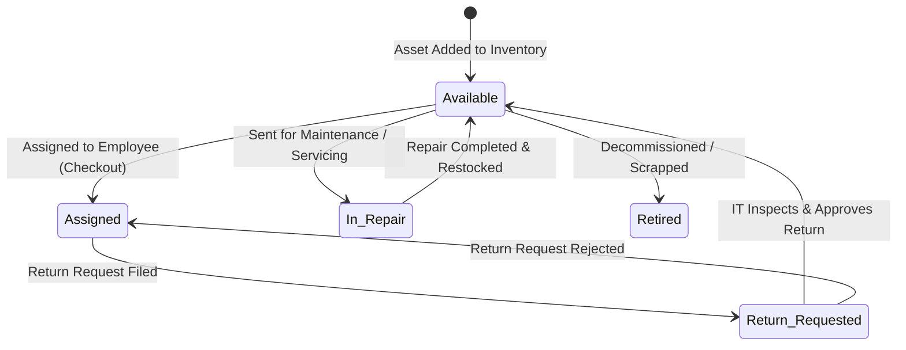

# 🏢 Company Asset Management System (Enterprise Portal)

[](https://fastapi.tiangolo.com)
[](https://react.dev)
[](https://vitejs.dev)
[](https://www.sqlalchemy.org)
[](https://www.python.org)
[](backend/tests)
[](PROJECT_EXPLANATION_AND_INTERVIEW_PREP.md)
[](LICENSE)

An internal enterprise asset tracking portal to catalog company-owned hardware equipment and software licenses, assign them to employees, enforce a deterministic availability state machine, manage return requests, and track servicing throughout the asset lifecycle.

> 📚 **Technical Interview Prep:** Preparing for interviews regarding this project, its architecture, tech stack, and database? Read the comprehensive **[Project Explanation & Technical Interview Preparation Master Guide](PROJECT_EXPLANATION_AND_INTERVIEW_PREP.md)**!

---

## 📑 Table of Contents
0. [Interview Preparation & Deep Dive Guide](PROJECT_EXPLANATION_AND_INTERVIEW_PREP.md)
1. [Key Features](#-key-features)
2. [Deterministic State Machine](#-deterministic-state-machine)
3. [Architecture & Tech Stack](#-architecture--tech-stack)
4. [Role-Based Access & Demo Credentials](#-role-based-access--demo-credentials)
5. [Quickstart (Run Locally)](#-quickstart-run-locally)
6. [One-Click Docker Deployment](#-one-click-docker-deployment)
7. [Cloud Deployment Guides](#-cloud-deployment-guides)
   - [Deploy on Render.com (Full-Stack Blueprint)](#1-deploy-on-rendercom-recommended)
   - [Deploy Frontend on Vercel + Backend on Render/Railway](#2-deploy-frontend-on-vercel--backend-on-renderrailway)
   - [Deploy with Docker on Railway / Fly.io](#3-deploy-with-docker-on-railway--flyio)
8. [REST API Documentation](#-rest-api-documentation)
9. [How to Push to GitHub](#-how-to-push-to-github)
10. [Automated Testing](#-automated-testing)

---

## 🚀 Key Features

- **Hardware & Software License Cataloging:** Full CRUD management for laptops, monitors, mobile devices, peripherals, and software seats with serial numbers, license keys, purchase dates, and warranty information.
- **Relational Employee Custody Tracking:** Timestamped checkout and check-in custody tracking with condition logs (`Brand New`, `Excellent`, `Good`, `Fair`, `Damaged`).
- **Deterministic State Machine:** Enforces valid status transitions with audit logs recording every state change and user reason.
- **Employee Self-Service Portal (`/my-assets`):** Dedicated staff view to inspect checked-out equipment, file official return requests, and view historical custody.
- **Maintenance & Servicing Tickets:** Track vendor repairs, battery replacements, screen fixes, costs, and scheduled completion dates.
- **Real-Time Enterprise Analytics:** Live dashboard KPI cards, hardware distribution charts, and audit activity feeds.
- **Post-Login Security Initialization:** Micro-animated loading screen verifying session tokens, role policies, and inventory synchronization.

---

## 🔄 Deterministic State Machine

Company equipment strictly follows a validated lifecycle state machine:



| Source State | Target State | Trigger / Action |
| :--- | :--- | :--- |
| **Available** | **Assigned** | Hardware / License allocated to employee |
| **Assigned** | **Return Requested** | Employee files a return request via portal |
| **Return Requested** | **Available** | IT approves return & logs condition |
| **Available** | **In Repair** | Service / Maintenance ticket opened |
| **In Repair** | **Available** | Service ticket resolved & inspected |
| **Available** | **Retired** | Asset reach end-of-life or irreparable |

---

## 🏛️ Architecture & Tech Stack

```
company-asset-management/
├── backend/                    # FastAPI REST API & SQLAlchemy ORM
│   ├── app/
│   │   ├── models/             # SQLAlchemy ORM database models
│   │   ├── schemas/            # Pydantic v2 validation schemas
│   │   ├── routers/            # API endpoints (Assets, Employees, Auth, etc.)
│   │   ├── database.py         # DB connection & SQLite/PostgreSQL engine
│   │   └── main.py             # FastAPI app, CORS, lifespan seeder
│   ├── tests/                  # 23 automated Pytest test cases
│   ├── seed.py                 # Enterprise database seeder
│   ├── Dockerfile              # Backend container configuration
│   └── requirements.txt        # Python dependencies
│
├── frontend/                   # React 19 + Vite SPA
│   ├── src/
│   │   ├── components/         # Reusable UI components (tables, modals, etc.)
│   │   ├── pages/              # Dashboard, Assets, Employees, MyAssets, Login
│   │   ├── context/            # AuthContext & ToastContext
│   │   ├── services/           # Fetch API client & transparent mock fallback
│   │   └── assets/styles/      # Vanilla CSS design system
│   ├── nginx.conf              # Production Nginx reverse-proxy & SPA routing
│   ├── Dockerfile              # Multi-stage production container
│   └── package.json            # Node.js dependencies
│
├── .github/workflows/ci.yml    # GitHub Actions automated test & build pipeline
├── docker-compose.yml          # Full-stack container orchestration
├── render.yaml                 # Render infrastructure-as-code blueprint
└── README.md                   # Project documentation
```

---

## 👥 Role-Based Access & Demo Credentials

The portal supports **Administrator** and **Employee** roles, with **1-click instant login buttons** on the login page:

| Role | Email / Identifier | Password | Access Scope |
| :--- | :--- | :--- | :--- |
| **🛡️ Administrator** | `admin@company.com` | `admin123` | Full access to Dashboard, Assets CRUD, Employees, Allocations, Returns, Servicing, and Analytics. |
| **👤 Employee (Rahul)** | `EMP-1001` | `password123` | Self-Service Portal (`/my-assets`), assigned hardware list, return requests, catalog view. |
| **👤 Employee (Priya)** | `EMP-1002` | `password123` | Mobile testing device custody, return requests, past checkout history. |

> **Self-Service Registration:** New employees can also click **➕ Create New Account** on the login screen to register with their name, work email, and department.

---

## 💻 Quickstart (Run Locally)

### Prerequisites
- **Python 3.11+**
- **Node.js 18+** & **npm**

### 1. Start the Backend API

```bash
# Navigate to backend
cd backend

# Create & activate virtual environment (Windows PowerShell)
python -m venv venv
.\venv\Scripts\Activate.ps1

# (On Linux/macOS: source venv/bin/activate)

# Install dependencies
pip install -r requirements.txt

# Run database seeder (populates realistic assets & employees)
python seed.py

# Launch FastAPI server
uvicorn app.main:app --port 8000 --reload
```
*Backend Swagger API documentation will be available at:* `http://localhost:8000/docs`

---

### 2. Start the Frontend Portal

In a new terminal window:

```bash
# Navigate to frontend
cd frontend

# Install dependencies
npm install

# Start Vite development server
npm run dev
```
*Frontend application will be running at:* `http://localhost:5173`

---

## 🐳 One-Click Docker Deployment

Run the complete full-stack system (FastAPI backend + React frontend + SQLite database) with a single command:

```bash
# Build and run containers
docker-compose up --build
```

- **Frontend Application:** `http://localhost:3000`
- **Backend API:** `http://localhost:8000`
- **Swagger Documentation:** `http://localhost:8000/docs`

---

## ☁️ Cloud Deployment Guides

### 1. Deploy on Render.com (Recommended)
This repository includes a [`render.yaml`](render.yaml) blueprint that configures both services automatically:

1. Push your repository to **GitHub**.
2. Log in to [Render.com](https://render.com).
3. Click **New +** -> **Blueprint**.
4. Connect your GitHub repository.
5. Render will automatically detect `render.yaml` and provision:
   - `asset-management-api` (Python FastAPI Web Service)
   - `asset-management-portal` (React Static Site with SPA rewrites)
6. Click **Apply** — Render builds and deploys both services automatically.

---

### 2. Deploy Frontend on Vercel + Backend on Render/Railway

#### Backend on Render:
1. On Render, click **New +** -> **Web Service**.
2. Select your repository, set **Root Directory** to `backend`.
3. Set **Runtime** to `Python 3`.
4. **Build Command:** `pip install -r requirements.txt`
5. **Start Command:** `uvicorn app.main:app --host 0.0.0.0 --port $PORT`
6. Copy your deployed backend URL (e.g., `https://asset-management-api.onrender.com`).

#### Frontend on Vercel:
1. Log in to [Vercel](https://vercel.com) and click **Add New** -> **Project**.
2. Select your repository, set **Root Directory** to `frontend`.
3. In **Environment Variables**, add:
   - `VITE_API_BASE_URL` = `https://asset-management-api.onrender.com/api`
   - `VITE_USE_MOCK` = `false`
4. Click **Deploy**. (The included [`vercel.json`](frontend/vercel.json) handles SPA client routing).

---

### 3. Deploy with Docker on Railway / Fly.io

Because this repository contains root `docker-compose.yml` and individual `Dockerfile`s:
1. On **Railway.app**, click **New Project** -> **Deploy from GitHub Repo**.
2. Select `backend` to deploy with persistent volume.
3. Add a PostgreSQL database add-on if desired, and set the `DATABASE_URL` environment variable.

---

## 📡 REST API Documentation

The backend includes interactive OpenAPI documentation at `/docs`:

| Method | Endpoint | Description |
| :--- | :--- | :--- |
| `POST` | `/api/auth/login` | Authenticate Administrator or Employee |
| `POST` | `/api/auth/register` | Self-register a new employee account |
| `GET` | `/api/stats` | Dashboard KPI summary statistics |
| `GET` | `/api/assets` | Filter & search hardware and license catalog |
| `POST` | `/api/assets` | Create a new asset with tag and serial |
| `GET` | `/api/assets/{id}` | Detailed asset specifications & custody history |
| `PUT` | `/api/assets/{id}` | Update asset details |
| `DELETE` | `/api/assets/{id}` | Remove asset record |
| `GET` | `/api/employees` | Search and list company employees |
| `POST` | `/api/employees` | Add new employee to directory |
| `GET` | `/api/assignments` | List active and historical asset allocations |
| `POST` | `/api/assignments` | Check out asset to employee (updates state to `Assigned`) |
| `POST` | `/api/assignments/{id}/return` | Check in asset (updates state to `Available`) |
| `GET` | `/api/return-requests` | View pending return requests |
| `POST` | `/api/return-requests` | Employee files a return request |
| `POST` | `/api/return-requests/{id}/approve` | IT approves return and inspects equipment |
| `POST` | `/api/return-requests/{id}/reject` | IT rejects return request with reason |
| `GET` | `/api/service-records` | Maintenance tickets and repair records |
| `POST` | `/api/service-records` | Create service ticket (sets state to `In Repair`) |

---

## 🐙 How to Push to GitHub

To push this project to your GitHub account:

```bash
# 1. Initialize git repository
git init

# 2. Add all files
git add .

# 3. Create initial commit
git commit -m "feat: complete enterprise asset management system with FastAPI and React"

# 4. Rename main branch
git branch -M main

# 5. Connect your remote repository (replace with your GitHub URL)
git remote add origin https://github.com/<YOUR_GITHUB_USERNAME>/company-asset-management.git

# 6. Push to GitHub
git push -u origin main
```

---

## 🧪 Automated Testing

### Backend Unit & Integration Tests (Pytest)
```bash
cd backend
python -m pytest -v
```
*Runs 23 automated tests verifying CRUD integrity, assignment checkout state machine transitions, return request processing, and authentication.*

### Frontend Code Quality (ESLint & Production Build)
```bash
cd frontend
npm run lint
npm run build
```
*Verifies JSX code quality, zero lint warnings, and compiles the production bundle in under 200ms.*

---

## 📄 License
This project is open-source and available under the [MIT License](LICENSE).
